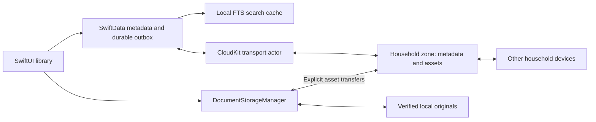

# Milestone 6: iCloud and household architecture

Design target originally recorded September 14, 2026. The sections below describe the intended architecture and acceptance gates, including features beyond the current implementation.

**Implementation update, September 19:** CloudKit transport, account binding, normalized local collections, incoming documents, text queues, conditional saves, original transfers, conflict review, and native sharing UI now exist. Default builds remain local. A signed private-cloud smoke test now passes; cross-account household acceptance remains outstanding. [Current implementation](ARCHITECTURE.md) is authoritative for implemented behavior; [setup](ICLOUD_SETUP.md) lists the remaining live gates.

Differences from the target: deterministic archive/content-derived cloud document IDs replace hash-claim records; memberships travel in document snapshots; conflicts remain local; discovery explicitly enumerates zones rather than maintaining database-change subscriptions. Text generations use one bounded chunked JSON blob. Thumbnails, cache eviction/pin UI, synchronized conflict records, and permanent deletion are not implemented. Collection aliases preserve local names; there is no rename/merge UI. Full scans after expired tokens do not reconcile missing records as deletions.

## Decision

Use an explicit CloudKit transport over the existing local archive. Each household occupies one custom record zone in its owner's private database. A zone-wide, invitation-only `CKShare` grants household members access through their shared databases. Keep SwiftData, originals, and the rebuildable SQLite search index on each Mac; never synchronize a SQLite store or its sidecars through iCloud Drive.

Once uploads finish, another member can retrieve documents while the importing Mac is offline. CloudKit serves the archive; no household device serves other devices. Offline Macs retain local browsing, search over downloaded text, editing, and access to downloaded originals. Uploading and fetching uncached originals require connectivity.

Apple supports zone-wide sharing for collections of records. Shared records remain in the owner's private database, with participants accessing a shared-database view. Shared storage counts against the owner's quota. These are ownership constraints, even though the product presents a collaborative household. [Shared records](https://developer.apple.com/documentation/cloudkit/shared-records), [shared database scope](https://developer.apple.com/documentation/cloudkit/ckdatabase/scope/shared).

## Fetch metadata without downloading originals

Use database and record-zone change operations, persisted change tokens, and an explicit `desiredKeys` allowlist. The metadata feed excludes every asset payload field. Fetch original assets separately by record ID only when requested by the storage manager. Metadata refreshes must not invoke file downloads through a convenience API with default options.

`CKFetchRecordZoneChangesOperation.ZoneConfiguration.desiredKeys` supports field selection; `nil` requests all fields. Include the union of required metadata fields for every record type in the zone. This makes one share cover both metadata and originals without requiring a second asset-zone invitation. [Field selection](https://developer.apple.com/documentation/cloudkit/ckfetchrecordzonechangesoperation/zoneconfiguration/desiredkeys), [record-zone changes](https://developer.apple.com/documentation/cloudkit/ckfetchrecordzonechangesoperation).

The installed Xcode 26.3 / macOS 26.2 SDK's `CKSyncEngine.FetchChangesOptions` exposes scope, operation group, and prioritized zone IDs, but no asset-field projection. Therefore this design uses explicit change operations initially. This is an SDK observation, not a claim about all future releases. Before implementing storage optimization, prove on two accounts that the selected API excludes asset bytes from both private and shared change feeds, including initial fetch and token reset. Reconsider CKSyncEngine if a supported SDK provides equivalent control. [CKSyncEngine](https://developer.apple.com/documentation/cloudkit/cksyncengine-5sie5).

## Identity and local migration

Use an archive registry and one local SwiftData store and search index per archive. A cloud binding contains container identifier, development/production environment, current account identifier, database scope, complete zone ID including owner name, and archive UUID. Names and email addresses are display information, never authorization or database keys. Separate account bindings prevent a new signed-in user from inheriting another account's pending uploads.

Register the existing archive root in place when enabling sync; preserve original paths and UUIDs. Joining another household creates a separate root. This retains the current repository's single-archive assumptions and scopes content-hash uniqueness to an archive. Private documents can later occupy a separate unshared zone and store. A private collection inside a shared zone would not provide privacy.

Add a new versioned local schema for cloud bindings, outbox operations, server baselines, cursors, transfer receipts, storage policy, field provenance, and conflicts. Do not edit frozen V1–V4 model definitions. Existing name-based collections need stable UUIDs and explicit membership records; migrate names and memberships in bounded, resumable batches. Preserve existing manual-field protection from analysis records. A rename must change a label, not document identity or file location. Two concurrently created collections with the same name retain distinct identities until explicitly merged; the future normalized schema must permit this.

Migration must leave the existing archive usable without iCloud. Back up and reopen a populated V4 fixture before and after migration, including Trash, protected empty fields, interrupted OCR, and index receipts. Only mark migration complete after its records and checkpoint commit together.

## Cloud records and local-only state

Record names and references use opaque archive-scoped IDs. Every payload has a format version. Unsupported versions remain recoverable and block editing of that record rather than being overwritten by an older client.

| Record | Synchronized content |
| --- | --- |
| Household | Archive UUID, display name, format version. Membership authority comes from CKShare. |
| Document | Stable UUID, immutable original identity, title, dates, correspondent, summary, favorite, review state, tags/entities, Trash state, original manifest reference, applied-field provenance and manual protections. |
| Collection / Membership | Collection UUID and label; separate document–collection edge records, including removals. |
| OriginalManifest / OriginalChunk | Whole-file SHA-256, byte count, type, ordered chunk identities and hashes; immutable CKAsset bytes in chunk records. |
| TextManifest / TextChunk | Source content hash, extractor version, page boundaries/methods, checksums, bounded extracted-text assets. |
| Thumbnail | Source hash, renderer version, bounded thumbnail asset; regenerable. |
| Conflict | Field, conflicting values and operation identities, resolution state; visible to all members. |
| Deletion marker | Stable identity and deletion generation for a future permanent-delete feature. No physical purge in the first sync release. |

Keep processing jobs, retry counts, progress, local paths, access times, downloads, cache pins, search receipts, and FTS files local. Unaccepted AI proposals stay local initially. Applied suggestions synchronize as metadata, including protection established by explicit acceptance. Remote documents do not automatically restart OCR or classification on every receiving device. The importing device publishes derived results; another device can explicitly reprocess a downloaded original.

Extracted text and thumbnails download in a separate low-priority, resumable queue so search can work without originals. Index each committed text batch through the existing search journal. Until that queue catches up, show that some document text is still downloading; never imply complete full-text results. Accept derived data only when its source hash matches the immutable original identity. Reprocessing publishes a new immutable text generation, then changes its manifest pointer; readers never combine generations. Concurrent generation-pointer updates use conflict handling, not blind replacement.

## Durable synchronization

Keep the transport behind a small protocol with a deterministic fake implementation for tests. A service actor performs networking, transfer scheduling, and retry bookkeeping; the repository applies short local transactions. Start with bounded pages and limited concurrent transfers, then measure against a 50,000-document archive. Normal launches read durable cursors and pending work, not every document.

1. A local edit saves metadata, manual provenance, a unique outbox operation with its base version, and the existing search receipt in one transaction. Preserve local work while offline.
2. Upload using the last server record's system fields and `ifServerRecordUnchanged`. Retain the operation until its individual save succeeds. Acknowledge the exact operation ID; a newer edit made during upload must remain pending. Fetch after an uncertain response to recognize an already-applied operation instead of duplicating it.
3. Discover changed zones with database changes, then fetch each zone's paginated metadata changes. Persist discovered-zone work before advancing the database cursor. Save each successfully applied record batch, its zone token, and search receipts together. A partial record failure prevents advancing beyond uncommitted data.
4. Maintain a server baseline separately from the locally edited view. Incoming changes merge against that baseline and pending edits; they do not overwrite dirty fields. Keep partial metadata records separate from complete asset records so a projected fetch cannot accidentally clear an asset during a later save.
5. Treat notifications as wake-up hints. Also catch up at launch, foreground activation, and explicit refresh. Persist retry deadlines, honor server retry delays, and use bounded backoff. Distinguish connectivity, quota, authentication, permission, malformed data, and unsupported schema errors.

CloudKit rejects stale conditional saves with `serverRecordChanged`; merge against the returned server record and retry with its system fields. [Conditional save policy](https://developer.apple.com/documentation/cloudkit/ckmodifyrecordsoperation/recordsavepolicy/ifserverrecordunchanged), [conflict error](https://developer.apple.com/documentation/cloudkit/ckerror/serverrecordchanged).

An expired token triggers a paginated refetch with a fresh token. Preserve unsent edits and originals. Track a rescan generation and reconcile missing server records only after the complete authoritative scan succeeds. Never interpret an interrupted page or missing permission as proof of document deletion. A deleted or inaccessible zone suspends its binding; it must not cause automatic recreation and reupload. [Database change recovery](https://developer.apple.com/documentation/cloudkit/ckfetchdatabasechangesoperation/fetchdatabasechangescompletionblock).

## Conflicts and duplicates

Use three-way, field-level merging with base, local, and server values. Merge independent field edits. A manual value, including a deliberately cleared value, wins against an automatic suggestion. Concurrent different manual values preserve both in a durable conflict and require review; display the server value with the pending alternative until resolved. Resolution references the observed conflict versions, so another edit cannot be silently discarded. Do not use device wall clocks as the authority.

For competing automatic values, select deterministically using the declared algorithm version and stable operation ID, retaining provenance. Do not rank incomparable provider confidence scores as if they were probabilities. Membership edge removals win over concurrent adds; an explicit later add based on the observed removal restores membership. Trash wins over a concurrent ordinary metadata edit, but preserve that edit. Restore is a new operation based on the observed Trash version. These policies must converge under reordered delivery.

The local content-hash check remains the first duplicate check. For cloud imports, use a deterministic content-claim record per hash within the zone. Atomically create the claim and canonical Document record; conditional creation lets only one concurrent claimant succeed. A losing device adopts the winning document UUID through a durable alias mapping before inserting remote metadata into the uniquely constrained local store. Preserve pending local edits through the same merge/conflict mechanism, including differing imported filenames as provenance. Keep its original recovery copy until the canonical cloud original is verified. Test the atomic-create behavior in private and shared zones before relying on it.

An offline import is immediately usable locally, but household duplicate reconciliation waits for connectivity. A duplicate whose original is cloud-only must not be treated as a corrupt local archive simply because the file is absent. Verify the committed remote manifest; a newly imported matching file can supply a safe local copy. Never discard that copy based only on an unverified hash claim. Hashes are scoped to a household; there is no global cross-user deduplication service.

Retain Trash indefinitely as today. A future permanent-delete action needs persistent tombstones to prevent an old offline device from resurrecting records. *(Implemented 2026-09-21 as described: tombstones never expire, and content records are deleted only after the tombstone is accepted.)* Do not implement fixed-age tombstone expiry, chunk garbage collection, or last-copy deletion in the first sync slice. Shared sync propagates deletions and is not an independent backup.

## Large files and transfer recovery

Start with immutable 8 MiB original chunks as an application transfer budget, not an asserted CloudKit limit. Each has a checksum, deterministic identity within its original generation, and a CKAsset. Keep manifests bounded; page the ordered chunk list for exceptionally large files. Large extracted text uses separate bounded assets too. Handle `limitExceeded` by reducing operation batches; never truncate an original. Validate actual supported file sizes and request limits with the provisioned environment. [CloudKit limit errors](https://developer.apple.com/documentation/cloudkit/ckerror/code/limitexceeded).

Upload chunks first, persist successful acknowledgments, and publish a committed manifest only after all required chunks succeed. The document may show metadata and “Uploading original” before that barrier; it is not yet safe for local eviction. Deterministic chunk IDs allow replay after a crash. Keep app-owned staging files alive through transfer completion. Asset chunk records are immutable; repair creates a new generation rather than replacing bytes beneath a committed manifest.

Before first allowing eviction of a locally imported original, perform an independent download-and-hash verification of its committed remote generation. This costs one verification transfer but avoids treating metadata acknowledgment as proof of a recoverable original. Never evict during quota errors, incomplete uploads, account uncertainty, or failed verification.

Downloads copy assets into app-owned staging, validate each chunk, assemble with bounded buffers, verify total size and whole-file SHA-256, then atomically promote to the original path and mark read-only. Persist a recovery receipt across the filesystem/database boundary as the importer does today. A failed transfer cannot replace a good local file. Resume verified chunks after restart; clean abandoned staging only when no pending operation references it.

## Storage behavior

`DocumentStorageManager` owns original resolution, transfer deduplication, access leases, and eviction. Preview, Quick Look, Open Copy, OCR, and export request a verified local URL through it. A local URL is no longer an unconditional property of a document. Missing bytes for a cloud-only original are expected; corrupt or unexpectedly missing pinned bytes are errors.

Separate retention policy from actual availability:

| User-facing state | Behavior |
| --- | --- |
| Cloud Only | Original absent locally; metadata and any downloaded text/thumbnails remain available. Opening requests a download. |
| Optimized | Storage manager may retain or evict a verified cloud-backed original according to recency and budget. |
| Available Offline | Device-local pin queues download and prevents automatic eviction; show pending until verification finishes. |

These labels summarize two underlying dimensions: `optimized/pinned` retention and `localVerified/cloudOnly/downloading/unavailable` availability. Pinning one Mac does not fill every household device. An offline cloud-only request explains that a connection is needed while preserving metadata access.

Evict least-recently-used originals only after remote verification, excluding pins, active read leases, imports, transfers, pending OCR, and recovery copies. Recheck eligibility immediately before removal and journal the transition. Keep lightweight text, metadata, and the search cache. Recent-document retention and a disk budget can follow; pins and essential metadata can exceed the budget, which is therefore a target, not a guarantee. Cache eviction ships only after failure and recovery tests pass.

## Sharing, account changes, and privacy

Use native macOS sharing UI and share acceptance, with `CKSharingSupported` enabled only when the feature is implemented. Default to private invitations and read/write household membership; support read-only participants correctly if encountered. The owner manages invitations. CloudKit read/write participants can modify or delete shared records, so app-level original immutability is not a security boundary against another authorized writer. Do not promise per-document roles or owner transfer in V1. [Sharing setup](https://developer.apple.com/documentation/cloudkit/sharing-cloudkit-data-with-other-icloud-users), [participant permissions](https://developer.apple.com/documentation/cloudkit/ckshare/participant).

On sign-out, account replacement, or revoked access, stop affected transfers and suspend the binding immediately when detected. Keep pending local work isolated for recovery. Hide the detached household from ordinary browsing; allow an explicit local recovery/export flow with clear status. Rejoining must verify the same identity and current access before replaying anything. Do not silently upload a detached archive into a different account. Revocation cannot retroactively erase copies someone already downloaded or prevent offline access before detection.

Cloud sync is opt-in and explains that originals, extracted text, and applied metadata are uploaded to the user's iCloud household. OCR and AI remain on-device; no external AI or telemetry is added. Use CloudKit encrypted fields for sensitive metadata from the first deployed schema; CKAssets have platform-managed encryption. Validate encrypted-field sharing and metadata projection together before freezing record types, since existing fields cannot simply be converted later. Do not claim custom end-to-end encryption or uniform protection across all account configurations. [Encrypting user data](https://developer.apple.com/documentation/cloudkit/encrypting-user-data), [encrypted fields](https://developer.apple.com/documentation/cloudkit/ckrecord/encryptedvalues).

Avoid filenames, OCR text, titles, share URLs, and account identifiers in routine logs. Treat downloaded strings and bytes as untrusted inputs with size/version checks. Cloud payloads contain no local paths or security-scoped bookmarks.

## Implementation sequence and acceptance gates

1. **Local foundation:** versioned models, normalized collections, durable outbox, conflict rules, fake transport, and storage-manager URL access. Sync remains disabled. Test migration, crash boundaries, duplicate aliasing, and reordered/replayed operations.
2. **CloudKit feasibility slice:** a provisioned development container and fictional fixtures only. Verify metadata-only change feeds, encrypted fields, immutable assets, atomic content claims, quota errors, and token resets on both private and shared databases. If projection or sharing does not meet these requirements, revise this note before proceeding.
3. **Personal archive sync:** opt-in upload and second-device metadata/original retrieval, all local originals retained. Test offline edits, interrupted transfers, same-field conflicts, sign-out, and restart at each acknowledgment boundary.
4. **Household sharing:** native invitation/acceptance with two different iCloud accounts. Test import/edit/search from both, owner Mac offline, participant removal, read-only membership, concurrent identical imports, and inaccessible/deleted zones. Confirm owner quota reporting and recovery behavior.
5. **Optimized storage:** background text/thumbnail delivery and verified original downloads, then pins and conservative eviction. Demonstrate full-text search with zero original downloads, multi-chunk recovery, corruption rejection, disk-full recovery, and no eviction of the last unverified copy.

Measure metadata startup, first search, catch-up memory, transferred original bytes, and cancellation responsiveness using a representative 50,000-document archive. Existing synthetic FTS measurements do not establish CloudKit or end-to-end launch performance.

External prerequisites for live tests are an Apple developer team/container with correct capabilities and signing, production-schema planning, and two test iCloud accounts/devices. The current ad-hoc local build supplies none of these. Use a development environment first; selecting a team, publishing schema, inviting people, and uploading real documents are separate feature/setup actions, not effects of this documentation milestone.

Milestone 6 is complete when these boundaries and acceptance gates are documented. The recommended next implementation is step 1, which can be tested locally before provisioning iCloud.
